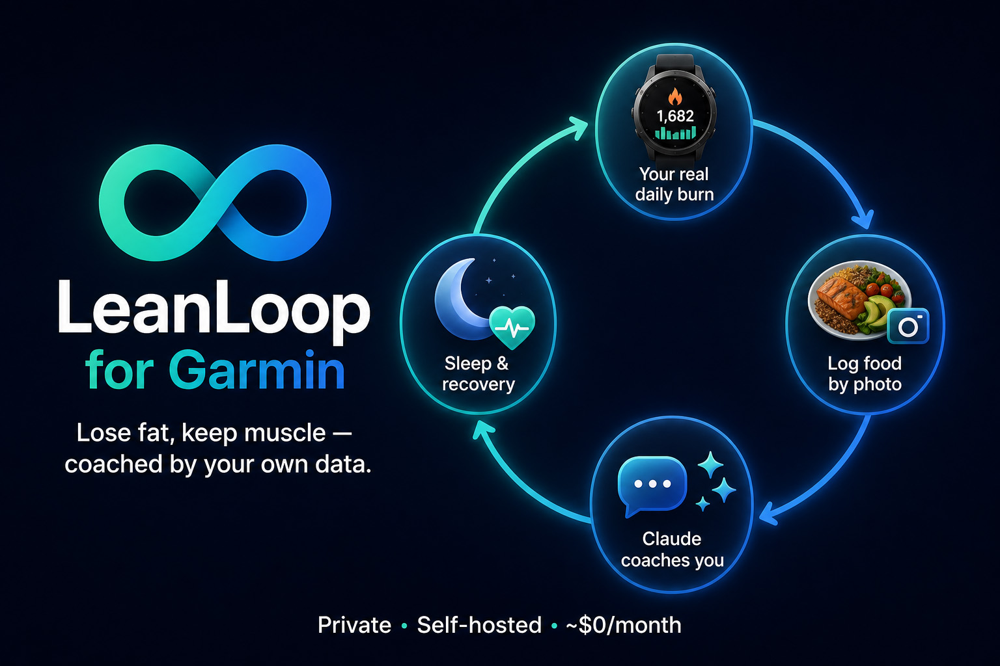

<p align="center">
  
</p>

**Turn Claude into your personal, data-driven health coach — self-hosted, private, ~$0/month.**

[](LICENSE)
[](https://modelcontextprotocol.io)
[](https://cloud.google.com/run)
[](requirements.txt)

Your own MCP server connects Claude to your **Garmin** wearable data (35 tools) and your **Notion** workspace. A nightly job writes your *real* measured calorie burn into your food log — so your deficit numbers come from your body, not from generic formulas — and a built-in calibration loop checks them against your actual scale weight every two weeks.

> Chat with Claude like a coach who has actually seen your data:
> *"How did I sleep?" · "Coach me today" · "Why did my run feel bad?" ·* 📸 *[photo of lunch]*

## ✨ Features

| | Feature | What it does |
|---|---|---|
| 📸 | **Photo food logging** | Send a meal photo → macros estimated with a documented protocol (reference-object scaling, hidden oil/sauce accounting) → auto-saved to Notion |
| 🌙 | **Automatic day close** | Every night your server pulls the finished day's true TDEE from Garmin and writes TDEE + workouts into your log (your deficit column recalculates itself instantly — it's a Notion formula) — self-heals 3 days back, colored sync tags show status at a glance |
| 🔥 | **Progress you can see** | Cumulative deficit (≈ kg of fat) updated nightly right on your Notion food log |
| 🏃 | **Coaching on real data** | One-call readiness verdicts, post-workout analysis (splits, HR zones, sleep context), weekly reviews, injury pattern tracking |
| 📈 | **Second-by-second analysis** | FIT-file parsing: HR/pace/cadence streams + **aerobic decoupling** — the endurance metric real coaches use |
| ⚖️ | **Calibration loop** | Every 2 weeks: logged deficit vs. actual weight change reveals your personal estimation bias, which corrects all future estimates |
| 🔄 | **Live-updating brain** | Coaching rules live in [`playbook.md`](playbook.md), fetched by your server at runtime — improvements reach every user instantly, no reinstall |

## 🚀 Install (no coding needed)

Open Claude and paste:

```
Read https://github.com/bank3005-jpg/LeanLoop-for-Garmin/blob/stable/SETUP.md and set this up for me
```

Claude interviews you (goals, body stats), creates your Notion databases, walks you through the cloud steps, and wires everything into a **Claude Project** — a dedicated space where your coach lives, with your server and Notion connected and your coaching rules loaded automatically in every chat. **45–60 minutes, one time.**

**Prerequisites:** a Garmin watch · Notion account (free) · Google account with billing enabled (stays within free tier) · Claude plan with custom connectors · Windows or macOS computer for one step.

## 🏗️ Architecture

```
Claude (any device, incl. phone)
   └── your Cloud Run server  ← this repo, deployed to YOUR Google account
         ├── Garmin Connect   ← your token, created on your own computer
         ├── your Notion      ← food / training / body logs
         └── playbook.md      ← coaching rules, served live from GitHub
   Cloud Scheduler → nightly close-day job + keep-warm pings
```

**Privacy by design:** everything runs in *your* accounts. No third party — including this repo's author — ever sees your data. The server is protected by a long random secret; Garmin credentials never pass through chat.

## 🧰 What's inside (35 MCP tools)

**Wellness** sleep (+HRV, RHR, body battery) · stress · SpO2 · respiration · heart rate · daily summary
**Training** activities & date-range search · splits · HR zones · FIT streams · aerobic decoupling · training readiness/status · VO2max · race predictions · endurance & hill scores · lactate threshold · personal records · fitness age
**Body** weight history · body composition · **write** body-comp entries (log InBody/DEXA scans into Garmin)
**System** one-call coach snapshot · direct Notion food-log read/write · live playbook loader

## 🔄 Updating

- **Coaching rules** — update automatically (served live from this repo)
- **Server code** — `git pull` + one deploy command, or enable a Cloud Build trigger on `stable` for fully automatic deploys
- Want to customize the code? **Fork** the repo and point your deployment at your fork

## ❓ FAQ

**Is it really free?** Yes — Cloud Run free tier covers personal use many times over. The setup guide includes guardrails so you stay in it.
**Does my data go anywhere?** No. Your server, your Garmin token, your Notion. Self-hosted means self-owned.
**What if Garmin changes their API?** The community library this builds on ([python-garminconnect](https://github.com/cyberjunky/python-garminconnect)) gets patched quickly; update with one `git pull` + deploy.
**Garmin China accounts?** Not supported (separate system).
**No watch some days?** The nightly job falls back to your formula baseline and tags the day `estimated`.

## 💬 Why this exists

I'm not a programmer. I built LeanLoop together with Claude because I wanted to lose weight, get my confidence back, and just *feel better* — and I couldn't find a tracker that coached me on my **real** data instead of generic formulas. It worked for me, so I'm sharing it.

I use LeanLoop every single day and keep refining it as I go. If you hit a problem or want a feature, **[open a thread in Discussions](https://github.com/bank3005-jpg/LeanLoop-for-Garmin/discussions)** — I read everything.

## 🙏 Credits

Built on [python-garminconnect](https://github.com/cyberjunky/python-garminconnect) by cyberjunky · [fitdecode](https://github.com/polyvertex/fitdecode) · [MCP](https://modelcontextprotocol.io) by Anthropic.

## ⚠️ Disclaimer

This is a personal tracking and coaching tool, **not medical advice or a medical device**. Calorie and macro estimates are approximations. Consult a healthcare professional for medical decisions, and stop training and seek care for any concerning symptoms.

## 📄 License

[MIT](LICENSE) — use it, fork it, share it.
